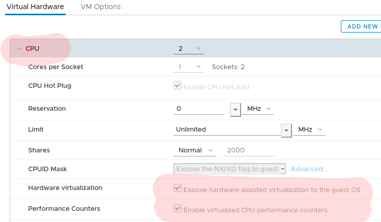

<!-- TOC -->

- [1. samutev: Salt Multipass Test Vm's](#1-samutev-salt-multipass-test-vms)
    - [1.1. requirements](#11-requirements)
    - [1.2. configuration](#12-configuration)
    - [1.3. usage](#13-usage)
    - [1.4. some details](#14-some-details)
        - [1.4.1. directories](#141-directories)
        - [1.4.2. vm defaults](#142-vm-defaults)
        - [1.4.3. performance](#143-performance)

<!-- /TOC -->

# 1. samutev: Salt Multipass Test Vm's

samutev helps you to deploy [quickly](#143-performance) local test vm's using multipass.

Test-vm's can be deployed either as masterless minion or as a master with minions.  
The resulting test-vm's are preconfigured with working saltstack.  
Inside the test-vm's the salt directories are mapped to /srv/salt/*  

## 1.1. requirements
- a [salt-repo-base-directory ($salt_base)](#12-configuration) with cloned repos `salt-states` and `salt-pillars` of your project inside
- ubuntu 20.04
- multipass (`apt install snapd; snap install multipass`)
- enough place for created vm-disks in `/var`
- enough memory forthe vm's - according to application needs
- internet connection (for things like package install)  
- In case of a vmware-vm as host, following settings are needed:  
  

## 1.2. configuration

If you are working first time with samutev, do once `cp samutev.conf.template samutev.conf`

In `samutev.conf` customize these settings to your need:
1. `salt_base=""`  
should be the directory of your salt project, where git repos `salt-states` and `salt-pillars` reside
2. `my_ssh_pub_key=""`   
used to deploy the ssh-pub-key to each launchend vm to `root` and to the normal user `user`. So you do `ssh root@<vm-ip>` or `ssh user@<vm-ip>`

Further, in `samutev.conf` you can customize [cloudinit](https://cloudinit.readthedocs.io/en/latest/) to bootstrap the vms.


## 1.3. usage
```
./samutev.sh -h
Usage:
        ./samutev.sh -h          Display this help message
        ./samutev.sh -n <VM>     new     <VM> with masterless minion
        ./samutev.sh -s <VM>     new     <VM> with minion and salt master, first vm => saltmaster, minimum of 2 vms.
        ./samutev.sh -d <VM>     delete  <VM>
        ./samutev.sh -l          list vms

Examples:
        ./samutev.sh -n  testvm                                  launch new testvm               as masterless minion
        ./samutev.sh -n 'testvm1 testvm2 testvm3'                launch multiple new testvms     as masterless minions
        ./samutev.sh -n 'testvm1:c2:m1:d3 testvm2:c4:m2'         launch multiple new testvms     as masterless minions
                                                                 with special settings for cpu, memory and disk:
                                                                         - testvm1 with: c2 => 2 cpu, m1 => 1GB memory and d3 => 3GB disk
                                                                         - testvm2 with: c4 => 4 cpu, m2 => 2GB memory
                                                                           (defaults are c2 m1 d3)

        ./samutev.sh -s 'salt-master1 testvm1 testvm2 testvm3'   launch a saltmaster with multiple new testvms
                                                                         - First vm = saltmaster
                                                                         - Minimum = 2 vms
        ./samutev.sh -s 'salt-master1:c2:m2:d6 testvm1'          same as above but with custom resource settings

        ./samutev.sh -d  testvm                                  delaunch/delete testvm
        ./samutev.sh -d 'testvm1 testvm2 testvm3'                delaunch/delete multiple testvms

```

## 1.4. some details

### 1.4.1. directories
In configured `$salt_base` (`samutev.conf`) two directories will be created, if not already there:
- `localstore/`  -   configured as `file_roots`  
   place to put states or binaries - outside of git repos
- `salt-dev-pillars/devpillars.sls`  -    configured as `pillar_roots`  
   place to put you dev-pillars - outside of git repos

Both directories will be available either to the salt master or to masterless minions directly

### 1.4.2. vm defaults

type | default
-----|--------
cpu | 2
memory | 1 (GB)
disk | 3 (GB)

### 1.4.3. performance
some meassured times, create 4 vm's, 1 salt-master and 3 minions:  
`samutev.sh -s "project-master project-app project-db project-web"`  

environment | time
------------|------
vm Testcluster (4GB RAM)| 10:49 min
Lenovo x390 (16GB RAM)| 04:27 min
Lenoveo P53 (32GB RAM)| 03:31 min
